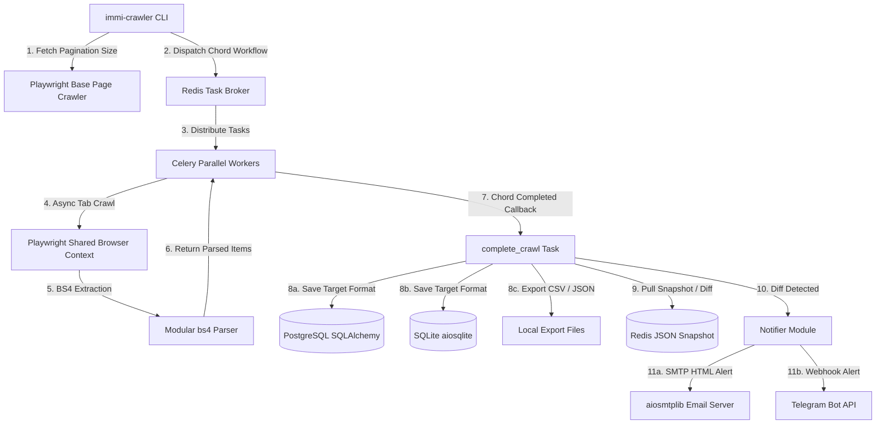

# Immi Crawler 🇦🇺

[](https://github.com/faaraaad/crawl_immi_homeaffairs/actions)
[](https://www.python.org/)
[](https://opensource.org/licenses/MIT)

A robust, high-performance async crawler for Australia's Skill Occupation List. Built with **Playwright Async**, **Celery**, **Redis**, **PostgreSQL** (via **SQLAlchemy Async ORM**), and **Pydantic Settings**.

---

## 🎯 Purpose & Motivation

Australia's Skill Occupation List changes frequently, impacting thousands of prospective migrants and employers. Tracking these changes manually is tedious and error-prone. 

`Immi Crawler` automates this process by scraping the official [Home Affairs Occupation List](https://immi.homeaffairs.gov.au/visas/working-in-australia/skill-occupation-list) on a fast, parallelized Celery task queue, storing listings in a structured database, comparing the current results with previous snapshots, and sending instant alerts via Email (SMTP) or Telegram whenever occupations are added or removed.

---

## 🏗️ Architecture



---

## ⚙️ Configuration Reference

Immi Crawler loads all settings dynamically from a local `.env` file at the root.

| Variable Name | Type | Default Value | Description |
|---|---|---|---|
| `BASE_URL` | `str` | `https://immi.homeaffairs.gov.au/...` | Target Skill Occupation List URL. |
| `CONCURRENCY` | `int` | `4` | Number of simultaneous browser crawlers. |
| `PAGE_LOAD_TIMEOUT` | `int` | `30000` | Locator timeout in milliseconds (30s). |
| `REDIS_URL` | `str` | `redis://localhost:6379/0` | Celery Broker & State Tracking Redis URI. |
| `DATABASE_URL` | `str` | `postgresql+asyncpg://...` | PostgreSQL destination database URI. |
| `OUTPUT_FORMAT` | `str` | `postgres` | Output storage (`postgres`, `sqlite`, `csv`, `json`). |
| `OUTPUT_DIR` | `str` | `output` | Directory folder to store JSON, CSV, and SQLite outputs. |
| `NOTIFIER_BACKEND` | `str` | `email` | Target notification backend (`email`, `telegram`, `both`). |
| `SMTP_HOST` | `str` | `localhost` | SMTP mail server host address. |
| `SMTP_PORT` | `int` | `1025` | SMTP port (e.g. `1025` for Mailpit / Mailhog). |
| `SMTP_USER` | `str` | `""` | Optional SMTP username. |
| `SMTP_PASSWORD` | `str` | `""` | Optional SMTP password. |
| `SMTP_SENDER` | `str` | `crawler@example.com` | Email sender address. |
| `SMTP_RECIPIENT` | `str` | `admin@example.com` | Target recipient address. |
| `TELEGRAM_BOT_TOKEN` | `str` | `""` | Token generated from Telegram BotFather. |
| `TELEGRAM_CHAT_ID` | `str` | `""` | Telegram User or Channel chat identifier. |

---

## 🚀 Quick Start (Docker Compose)

The easiest way to spin up the entire production-grade stack (Postgres 16, Redis 7, Celery Worker, CLI Crawler) is using `docker-compose`.

### Prerequisites
- Docker & Docker Compose installed.

### 1. Initialize Configuration
Create a `.env` file at the root of your workspace:
```bash
cp .env.example .env  # Or edit the default .env directly
```

### 2. Launch the Stack
Start the background infrastructure and Celery worker:
```bash
docker-compose up -d
```

### 3. Run the Database Migrations
Apply database migrations to set up the Postgres schema:
```bash
docker-compose run --rm crawler-cli alembic upgrade head
```

### 4. Execute a Full Crawl Run
Trigger the parallelized async crawler:
```bash
docker-compose run --rm crawler-cli immi-crawler crawl --output-format postgres --sync
```

---

## 🛠️ Local Development (Makefile)

For developer ergonomics, we provide a complete `Makefile`:

```bash
# 1. Install package and dev requirements (Ruff, Mypy, Pytest, Playwright)
make install

# 2. Run Ruff and strict Mypy checks
make lint

# 3. Execute Pytest suite
make test

# 4. Spin up local Redis & Postgres containers
make up

# 5. Run SQLAlchemy migrations via Alembic
make migrate

# 6. Execute full crawler run
make crawl
```

---

## 🔔 Change Detection & Notification Engine

One of the killer features is **Automated Differential Alerting**. 
1. At the end of every successful crawl run, the system retrieves the entire occupation list.
2. It compares it with the previous snapshot cached in Redis (`previous_crawl_snapshot` key).
3. If changes are detected (occupations added or removed), it generates a structured diff.
4. Alerts are dispatched to the selected `NOTIFIER_BACKEND`:
   - **Email:** Renders a gorgeous, custom HTML table with green inserts for additions and red markers for removals.
   - **Telegram:** Broadcasts markdown alert messages instantly to your channel or bot chat.

### Sample Diff Output

```json
{
  "scraped_at": "2026-05-19T21:09:04Z",
  "data": [
    {
      "occupation": "Software Engineer",
      "visa_subclass": "189",
      "stream": "State or Territory nominated"
    }
  ]
}
```

```
🚨 Immi Crawler Change Alert 🚨

*Added Occupations:*
➕ Cyber Security Specialist (Subclass 189 - State or Territory nominated)
➕ AI Engineer (Subclass 482 - Medium Term Stream)

*Removed Occupations:*
➖ Travel Consultant (Subclass 482 - Short Term Stream)
```

---

## 🤝 Contributing

Contributions are welcome! Please run `make lint` and `make test` before submitting pull requests.

1. Fork the Project
2. Create your Feature Branch (`git checkout -b feature/AmazingFeature`)
3. Commit your Changes (`git commit -m 'Add some AmazingFeature'`)
4. Push to the Branch (`git push origin feature/AmazingFeature`)
5. Open a Pull Request

---

## 📄 License

Distributed under the MIT License. See [LICENSE](LICENSE) for more information.